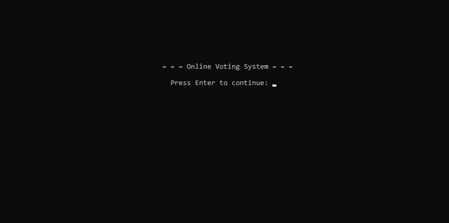
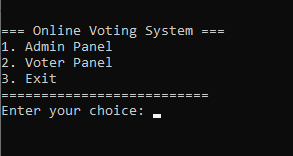
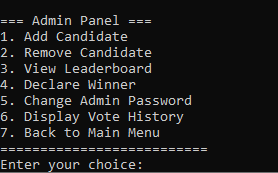
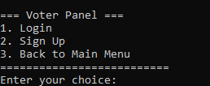
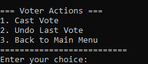

#  Online Voting System (C++)


---

##  Overview

The Online Voting System is a console-based application developed as part of a university group project for the Data Structures & Algorithms course.

The system simulates an election process by allowing users to register as voters, authenticate themselves, cast votes securely, and enables administrators to manage candidates and declare election results.

---
##  Learning Outcomes

This project strengthened my understanding of:

- Object-Oriented Programming in C++
- Data Structures and Algorithms
- File Handling
- Software Testing and Debugging
- Collaborative Software Development
  
##  Features

* Voter Registration
* Login Authentication
* Candidate Management
* Secure Vote Casting
* Duplicate Vote Prevention
* Election Result Generation
* Administrator Panel
* Persistent File Storage

---
## 📸 Screenshots

### Main Menu



### Registration / Login



### Voting Interface



### Admin Panel



### Election Result



##  Technologies

* C++
* Object-Oriented Programming
* Data Structures & Algorithms
* File Handling
* Code::Blocks IDE

---

##  Data Structures Used

| Data Structure | Purpose                    |
| -------------- | -------------------------- |
| unordered_map  | Fast voter lookup          |
| queue          | Managing voting operations |
| stack          | History management         |
| set            | Prevent duplicate voting   |

---

##  My Contribution

This project was completed collaboratively as part of a university team.

My contributions included implementation support, debugging, testing, integration of different project modules, validating application functionality, and improving the overall reliability of the system through collaborative development.

---

##  Skills Demonstrated

* C++ Programming
* Data Structures
* Object-Oriented Programming
* File Handling
* Debugging
* Software Testing
* Team Collaboration
* Problem Solving

---

##  Project Structure

```text
main.cpp
voting_system.h
candidates.txt
voters.txt
Pics/
docs/
```

---

##  Future Improvements

* GUI Interface
* SQLite/MySQL Database
* Password Encryption
* Online Voting Support
* Better User Interface

---

## 📌 Project Type

Academic Group Project

University Course: Data Structures & Algorithms
